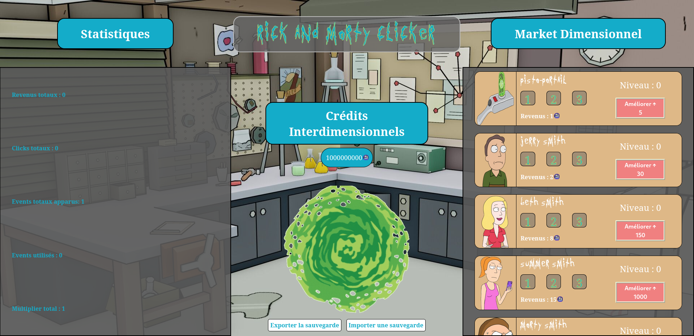

# __Rick and Morty Clicker__

Ce projet est un exercice d'école consitant à créer un jeu de Cookie Clicker avec un certain thème au choix.

## Groupe sur le projet
----------------------------

- Emilien CUNY : https://github.com/ArToXxFR

## Langages utilisés ? 
----------------------------

  - HTML 
  - CSS
  - JavaScript

## Frameworks
----------------------------

  - JQuery

## Le contenu
----------------------------

Ce jeu est est un Rick et Morty Clicker.

Le principe est simple, un portail est situé au milieu de la page.

A chaque clique sur ce portail, on gagne des crédits interdimensionnels.

On peut également avoir des personnages de la série comme Jerry, Beth ou encore Rick qui 
permettent de gagner des crédits automatiquement.

On peut améliorer chacun des personnages avec des crédits pour avoir en avoir encore plus.

On peut également acheter des bonus représentés par "1", "2" et "3" qui permettent de par exemple 
d'augmenter le multiplicateur global ou encore améliorer le revenu des personnages.

Des évènements peuvent également apparaitre aléatoire sur l'écran et permettent chacun à leur manière
de gagner pleins de crédits.

## Aperçu
----------------------------

#TODO 

## Installation
----------------------------

Cloner le dépôt en local à l'aide de la commande git clone.

Lancer la page index.html.

Il ne vous reste plus qu'à jouer !

